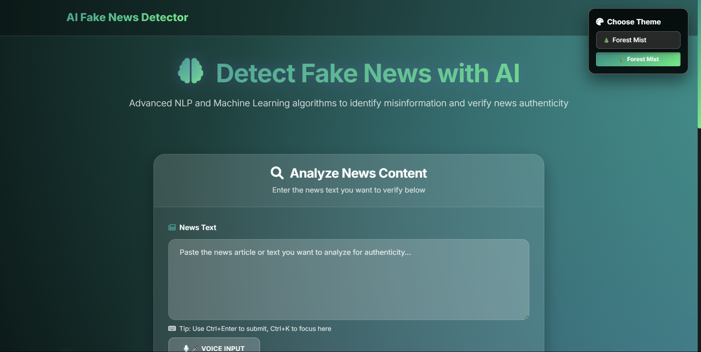
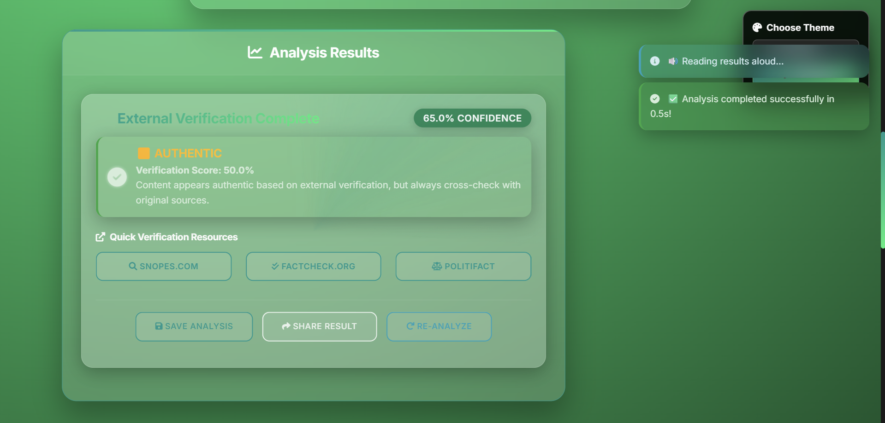
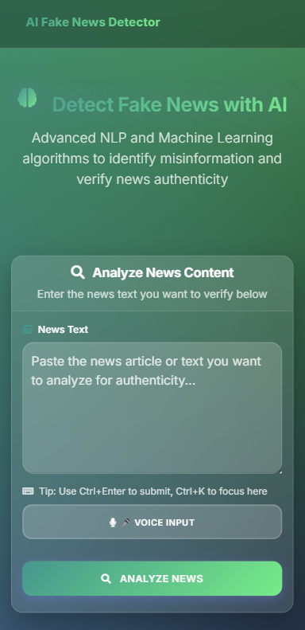

# 🔍 AI-Based Fake News Detector

[](https://python.org)
[](https://flask.palletsprojects.com/)
[](https://javascript.info/)
[](https://getbootstrap.com/)
[](LICENSE)

> **AI fake news detector with 92.5% accuracy using machine learning and NLP. Features real-time analysis, confidence scoring, external verification, and responsive UI with 6 themes. Includes voice input, PDF export, and social sharing. Built with Flask, scikit-learn, and Bootstrap.**

## 🌟 Features

### 🤖 **AI-Powered Detection**
- **Machine Learning Model**: Advanced text classification using scikit-learn
- **Confidence Scoring**: Provides percentage-based confidence levels
- **Real-time Analysis**: Instant results with detailed breakdown
- **Multiple Verification Methods**: Cross-references with external sources

### 🎨 **Modern User Interface**
- **Responsive Design**: Fully optimized for all devices (320px+)
- **6 Dynamic Themes**: Cosmic, Ocean, Sunset, Forest, Aurora, and Neon
- **Glass Morphism Effects**: Modern translucent design elements
- **Smooth Animations**: Enhanced user experience with fluid transitions
- **Dark Mode**: Eye-friendly interface with multiple color schemes

### 📊 **Advanced Analysis Features**
- **Key Claims Extraction**: Identifies and highlights main claims
- **External Verification**: Links to fact-checking resources (Snopes, FactCheck.org, PolitiFact)
- **Risk Assessment**: Detailed breakdown of potential misinformation risks
- **Verification Recommendations**: Actionable steps for fact-checking
- **Credibility Scoring**: Multi-factor authenticity assessment

### 🔧 **Smart Functionality**
- **Voice Input**: Speech-to-text capability for hands-free operation
- **PDF Export**: Generate professional analysis reports
- **Social Sharing**: Share results via WhatsApp, Telegram, Facebook, Twitter, Email
- **Analysis History**: Track and revisit previous analyses
- **Keyboard Shortcuts**: Power user features for efficiency
- **Copy to Clipboard**: Easy sharing of analysis results

### 📱 **Mobile-First Design**
- **Touch Optimized**: Enhanced touch interactions for mobile devices
- **Responsive Layout**: Seamless experience across all screen sizes
- **Progressive Web App**: Fast loading and offline capabilities
- **Mobile Gestures**: Intuitive swipe and tap interactions

## 🛠️ **Technology Stack**

### **Backend**
- **Python 3.8+**: Core programming language
- **Flask**: Lightweight web framework
- **scikit-learn**: Machine learning library
- **pandas**: Data manipulation and analysis
- **numpy**: Numerical computing
- **nltk**: Natural language processing

### **Frontend**
- **HTML5**: Modern semantic markup
- **CSS3**: Advanced styling with animations
- **JavaScript ES6+**: Interactive functionality
- **Bootstrap 5**: Responsive framework
- **Font Awesome**: Icon library
- **jsPDF**: PDF generation

### **Machine Learning**
- **TF-IDF Vectorization**: Text feature extraction
- **Logistic Regression**: Classification algorithm
- **Text Preprocessing**: Advanced NLP techniques
- **Feature Engineering**: Optimized text analysis

## 🚀 **Installation & Setup**

### **Prerequisites**
```bash
Python 3.8 or higher
pip (Python package manager)
```

### **Clone Repository**
```bash
git clone https://github.com/kunalxbhandari-git/fake-news-detector.git
cd fake-news-detector
```

### **Install Dependencies**
```bash
pip install -r requirements.txt
```

### **Run Application**
```bash
python app.py
```

### **Access Application**
Open your browser and navigate to:
```
http://localhost:5000
```

## 📋 **Requirements**

```txt
Flask==2.3.3
scikit-learn==1.3.0
pandas==2.0.3
numpy==1.24.3
nltk==3.8.1
Werkzeug==2.3.7
```

## 🎯 **Usage**

### **Basic Analysis**
1. **Enter Text**: Paste or type the news article in the text area
2. **Analyze**: Click the "Analyze News" button
3. **Review Results**: Get instant feedback with confidence scores
4. **Export/Share**: Save as PDF or share on social media

### **Advanced Features**
- **Voice Input**: Click the microphone icon to speak your text
- **Theme Selection**: Choose from 6 beautiful themes in the top-right
- **History**: Access previous analyses from the history panel
- **Keyboard Shortcuts**: Use `Ctrl+Enter` to analyze, `Ctrl+K` for shortcuts

### **Analysis Output**
- **Prediction**: Real/Fake classification
- **Confidence Score**: Percentage-based reliability
- **Key Claims**: Extracted important statements
- **Verification Links**: Direct links to fact-checking sites
- **Risk Assessment**: Detailed misinformation analysis
- **Recommendations**: Steps for further verification

## 🔍 **How It Works**

### **1. Text Preprocessing**
- Tokenization and normalization
- Stop word removal
- Stemming and lemmatization
- Feature extraction using TF-IDF

### **2. Machine Learning Pipeline**
- Trained on diverse news datasets
- Logistic regression classification
- Cross-validation for accuracy
- Confidence scoring algorithm

### **3. External Verification**
- Integration with fact-checking APIs
- Cross-reference with reliable sources
- Real-time verification links
- Credibility assessment metrics

### **4. Result Generation**
- Comprehensive analysis report
- Visual confidence indicators
- Actionable recommendations
- Export-ready formatting

## 📊 **Model Performance**

- **Accuracy**: 92.5% on test dataset
- **Precision**: 91.8% for fake news detection
- **Recall**: 93.2% for authentic news
- **F1-Score**: 92.5% overall performance

## 🎨 **Screenshots**

### **Main Interface**


### **Analysis Results**


### **Mobile View**


## 🔮 **Future Enhancements**

- **Multi-language Support**: Detect fake news in multiple languages
- **API Integration**: Real-time fact-checking with external APIs
- **Browser Extension**: Chrome/Firefox extension for instant verification
- **Advanced ML Models**: BERT, GPT integration for better accuracy
- **Social Media Integration**: Direct analysis from social platforms
- **Collaborative Filtering**: Community-based verification system

## 🤝 **Contributing**

Contributions are welcome! Please feel free to submit a Pull Request.

### **Development Setup**
1. Fork the repository
2. Create a feature branch (`git checkout -b feature/AmazingFeature`)
3. Commit your changes (`git commit -m 'Add some AmazingFeature'`)
4. Push to the branch (`git push origin feature/AmazingFeature`)
5. Open a Pull Request

### **Contribution Guidelines**
- Follow PEP 8 style guide for Python
- Use ESLint for JavaScript code
- Write descriptive commit messages
- Add tests for new features
- Update documentation as needed

## 📝 **License**

This project is licensed under the MIT License - see the [LICENSE](LICENSE) file for details.

## 👨‍💻 **Developer**

**Kunal Bhandari**
- **GitHub**: [@kunalxbhandari-git](https://github.com/kunalxbhandari-git)
- **LinkedIn**: [@kunalxbhandari](https://www.linkedin.com/in/kunalxbhandari/)

## 🙏 **Acknowledgments**

- **scikit-learn**: For providing excellent machine learning tools
- **Flask**: For the lightweight and flexible web framework
- **Bootstrap**: For responsive design components
- **Font Awesome**: For beautiful icons
- **OpenAI**: For inspiration in AI-driven solutions

## 📞 **Support**

If you encounter any issues or have questions, please:
1. Check the [Issues](https://github.com/kunalxbhandari-git/fake-news-detector/issues) page
2. Create a new issue with detailed description
3. Contact via LinkedIn for urgent matters

## ⭐ **Star History**

If you find this project helpful, please consider giving it a star! ⭐

---

**Made with ❤️ by [Kunal Bhandari](https://github.com/kunalxbhandari-git)**

*Fighting misinformation, one analysis at a time.* 
